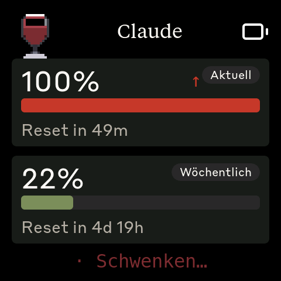
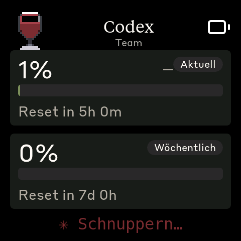
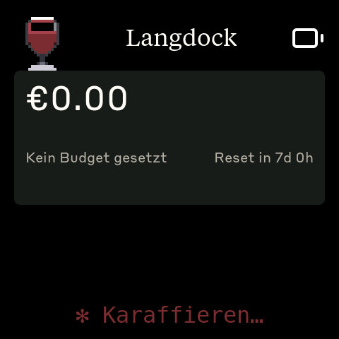
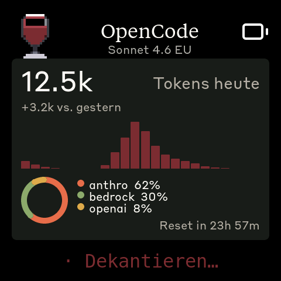

# Clawdmeter

Ein ESP32-S3 Hardware-Monitor für LLM-API-Nutzung. Pollt auf einem Host-Rechner
mehrere Provider parallel und zeigt Auslastung, Tokenverbrauch und Limit-
Erreichung auf einem AMOLED-Display.

Unterstützt heute folgende Provider:

|              Provider              | Status       |                         Was es zeigt                          |
| ---------------------------------- | ------------ | ------------------------------------------------------------- |
| **Anthropic Claude** (Claude Code) | aktiv        | 5h + 7d Rolling-Window-Auslastung, Reset-Timer, Burn-Rate     |
| **OpenAI Codex / ChatGPT**         | aktiv        | 5h-Session + 7d-Weekly-Auslastung, Plan-Typ, Reset-Timer      |
| **Langdock**                       | aktiv        | EUR-Workspace-Verbrauch vs. Budget, BYOK/managed-Aufschlüsselung |
| **OpenCode** (sst/opencode)        | aktiv        | Tokens heute, Vergleich Vortag, Backend-Mix-Donut, Aktivitäts-Histogramm |
| **AWS Bedrock**                    | ⏸️ pausiert   | Adapter-Code vorhanden, vom Setup-Wizard nicht angeboten — siehe Hinweis unten |

> **AWS-Bedrock-Status (Stand 2026-05-24)**: Der Bedrock-Adapter liest
> CloudWatch + Service Quotas und benötigt dafür IAM-Read-Only-Credentials.
> Bedrock-API-Keys (`AWS_BEARER_TOKEN_BEDROCK`) authentifizieren nur die
> Runtime-Endpoints und reichen nicht. Bis ein dedizierter IAM-Pfad
> eingerichtet ist, fragt der Setup-Wizard Bedrock nicht ab; der Code bleibt
> aber im Repo erhalten und lässt sich von Hand reaktivieren (siehe Abschnitt
> [Provider im Detail](#provider-im-detail) und
> [feature-documentation/providers/bedrock.md](feature-documentation/providers/bedrock.md)).

Jeder Provider ist optional und wird per Config-Datei einzeln aktiviert. Wer
nur Claude überwachen will, läuft mit einer 5-Zeilen-Config; wer ein Hybrid-
Setup hat, schaltet sich beliebig viele Screens dazu.

## Die UI auf einen Blick

Die Screens unten kommen direkt vom Gerät (480×480 AMOLED-2.16, Wine-Edition-
Build). Pro aktivem Provider rendert die Firmware genau einen Screen — die
Vorlage richtet sich nach dem `kind`-Feld des Daemons:

|       Anthropic Claude (`pct_window`)       |        OpenAI Codex (`pct_window`)         |          Langdock (`eur_window`)          |
| :-----------------------------------------: | :----------------------------------------: | :---------------------------------------: |
|  |        |  |
|  5h-Session + 7d-Weekly als Bar + Reset-Timer  | gleiches Layout wie Claude, Plan-Typ als Notiz |   EUR-Verbrauch, Budget-Bar, Monatsreset    |

|       OpenCode (`tokens_today`)        |          Splash (Wine Edition)          |         Bluetooth (Pairing/Status)         |
| :------------------------------------: | :-------------------------------------: | :----------------------------------------: |
|  |  |  |
| Tokens heute, Histogramm, Backend-Donut |  zyklische Pixel-Art (PWR-Taste blättert)  |     Connect-State, MAC, Bond-Reset      |

Gemeinsam ist allen Provider-Screens: oben links der **80×80-Logo-Slot**
(Wine-Glas in der Brand-Fork, sonst Anthropic-„Clawd"), oben mittig der
**Display-Name** + optionale Notiz (z. B. „Sonnet 4.6 EU", „Team", …), oben
rechts der **Akku- bzw. USB-Status**. Unten am Bildschirmrand läuft ein
**Status-Spinner** mit Wine-Vokabular („Karaffieren…", „Dekantieren…",
„Schwenken…", „Schnuppern…") oder neutralen Verben im Standard-Build.

> **Hinweis zur Hardware-Lineage**: Clawdmeter ist aus dem [Clawdmeter-Firmware
> von hermannbjrgvin](https://github.com/hermannbjrgvin) gefork-t als reiner
> Anthropic-Monitor und wurde zur generischen LLM-Plattform ausgebaut. Die
> Hardware-Liste und die HAL sind dieselben; siehe „Lizenz und Lineage" unten.

## Inhalt

- [Die UI auf einen Blick](#die-ui-auf-einen-blick)
- [Wie es funktioniert](#wie-es-funktioniert)
- [Hardware](#hardware)
- [Installation](#installation)
  - [Companion-App (empfohlen)](#empfohlen-companion-app-macos--windows)
  - [Power-User-Pfad (Shell-Skripte)](#power-user-pfad-shell-skripte)
- [Konfiguration](#konfiguration)
- [Provider im Detail](#provider-im-detail)
- [BLE-Protokoll](#ble-protokoll)
- [Geräte-UI](#geräte-ui)
- [Entwicklung](#entwicklung)
- [Lizenz und Lineage](#lizenz-und-lineage)

## Wie es funktioniert

```
   ┌─────────────────┐     ┌───────────────────────┐     ┌──────────────────┐
   │  LLM-Provider   │ ──► │  Clawdmeter-Daemon    │ ──► │  ESP32-S3        │
   │  (Anthropic /   │     │  (Python, BLE-Sender) │ BLE │  AMOLED-Display  │
   │   Bedrock / ...) │     │                       │     │                  │
   └─────────────────┘     └───────────────────────┘     └──────────────────┘
        REST / SDK              clawdmeter-daemon              Clawdmeter
```

Der **Daemon** läuft als systemd-User-Service (Linux), LaunchAgent (macOS)
oder Scheduled Task (Windows). Er pollt jeden aktiven Provider in seinem
eigenen Intervall (Anthropic 60s, Codex 60s, Bedrock 60s, OpenCode 15s,
Langdock 600s), normalisiert das Ergebnis und schickt es als JSON-Sequenz
über BLE an das Gerät.

Das **Gerät** hat keine Cloud-Anbindung. Es zeigt nur an, was der Daemon
schickt, und sendet daneben Tastaturkommandos (Space, Shift+Tab) als
BLE-HID-Tastatur — praktisch für Claude Code Voice-Mode oder
Mode-Toggle-Shortcuts.

Daten- und Konfigurationsfluss sind in
[feature-documentation/multi-provider/data-flow.md](feature-documentation/multi-provider/data-flow.md)
ausführlich beschrieben.

## Hardware

Drei Build-Envs, alle auf ESP32-S3-Basis:

|     Env (`-e` für `pio run`)   | Display                | Notes                                |
| ------------------------------ | ---------------------- | ------------------------------------ |
| `wine-216` *(Default)*         | 480×480, 2.16" rund    | jacques.de Wine Edition auf der 2.16"-Hardware ([Waveshare-Shop](https://www.waveshare.com/esp32-s3-touch-amoled-2.16.htm?&aff_id=149786)). Wein-Sprites, Bordeaux-Akzent. |
| `standard-216`                 | 480×480, 2.16" rund    | Standard-Clawdmeter auf der 2.16"-Hardware — 3 Buttons, IMU-Auto-Rotation, AXP2101-Akku |
| `standard-180`                 | 368×448, 1.8" Portrait | Standard-Clawdmeter auf der 1.8"-Hardware ([Waveshare-Shop](https://www.waveshare.com/esp32-s3-touch-amoled-1.8.htm?&aff_id=149786)) — 2 Buttons, feste Orientierung, 16 MB Flash |

Plus per Board:

- USB-C-Kabel zum Flashen und Laden
- 3.7 V Li-Po-Akku mit MX1.25 2-pin Stecker (optional)

**Porting**: Die Firmware ist HAL-strukturiert. Pro Board ein Ordner unter
`firmware/src/boards/<name>/`. Shared Code (`main.cpp`, `ui.cpp`,
`splash.cpp`) ist board-agnostic. Eine neue Plattform = neuer Ordner +
neuer `[env:...]`-Block in `firmware/platformio.ini`. Walkthrough in
[`docs/porting/adding-a-board.md`](docs/porting/adding-a-board.md), HAL-Contract
in [`docs/porting/hal-contract.md`](docs/porting/hal-contract.md).

## Installation

### Empfohlen: Companion-App (macOS & Windows)

Seit 2026-05-28 gibt es eine native Desktop-App, die Flashen, Daemon-
Installation, Provider-Setup und Status-Monitoring in einem Fenster
bündelt. Endanwender müssen weder PlatformIO noch Python noch eine
Shell anfassen.

- **macOS**: `.dmg` herunterladen, App in `/Applications` ziehen, beim ersten
  Start dem Bluetooth-Permission-Dialog zustimmen. Apple-notarized, keine
  Gatekeeper-Warnung.
- **Windows**: `.msi` herunterladen, doppelklicken. Per-User-Installation
  (kein UAC). Solange das Code-Signing-Cert noch nicht beschafft ist,
  zeigt SmartScreen eine Warnung, die weggeklickt werden muss.

Architektur & Bauanleitung der Companion-App:
[`feature-documentation/companion-app/`](feature-documentation/companion-app/).
Source: [`companion/`](companion/).

### Power-User-Pfad: Shell-Skripte

Die folgenden Installer / Flash-Skripte bleiben unverändert bestehen und
sind weiterhin der schnellste Weg, wenn man PlatformIO + Python ohnehin
auf der Maschine hat. Die Companion-App ist nur ein Wrapper um genau
diese Bausteine.

### Voraussetzungen (Shell-Pfad)

- macOS / Linux / Windows 10+
- [PlatformIO CLI](https://docs.platformio.org/en/latest/core/installation/index.html) zum Flashen
- Python 3.9+ (Daemon)
- BLE-fähiger Bluetooth-Adapter
- Mindestens ein Provider-Account (siehe [Provider im Detail](#provider-im-detail))

### 1. Firmware flashen

Auf macOS:

```bash
./flash-mac.sh                              # wine-216 (Default)
./flash-mac.sh --env=standard-216           # Standard 2.16"
./flash-mac.sh --env=standard-180           # Standard 1.8"
```

Auf Linux:

```bash
./flash.sh                              # wine-216 (Default), /dev/ttyACM0
./flash.sh --env=standard-216           # Standard 2.16"
./flash.sh --env=standard-180           # Standard 1.8"
```

Auf Windows (direkt via PlatformIO):

```powershell
cd firmware
pio run -e wine-216      -t upload --upload-port COM5    # Default (Wine Edition)
pio run -e standard-216  -t upload --upload-port COM5    # Standard 2.16"
pio run -e standard-180  -t upload --upload-port COM5    # Standard 1.8"
```

### 2. Pairing

Nach dem Flashen erscheint das Gerät als `Clawdmeter` in der Bluetooth-
Liste. Pairing ist OS-spezifisch:

- **macOS**: System-Einstellungen → Bluetooth → „Clawdmeter" → *Connect*
- **Windows**: Settings → Bluetooth & devices → Add device → Bluetooth → *Clawdmeter*
- **Linux**:
  ```bash
  bluetoothctl scan le
  bluetoothctl pair  <MAC>
  bluetoothctl trust <MAC>
  ```
  Die MAC steht auf dem Bluetooth-Screen des Geräts.

### 3. Daemon installieren

Die Installer richten alles ein: Python-venv, optionale Dependencies,
Setup-Wizard, autostart als Systemdienst.

| OS      | Befehl                                                                |
| ------- | --------------------------------------------------------------------- |
| macOS   | `./install-mac.sh`                                                    |
| Linux   | `./install.sh`                                                        |
| Windows | `powershell -ExecutionPolicy Bypass -File .\install-windows.ps1`      |

Während der Installation läuft der **Setup-Wizard** und fragt pro Provider
ob er aktiviert werden soll. Auto-Detect findet typischerweise von alleine:

- Claude OAuth-Token (Keychain auf macOS, `~/.claude/.credentials.json` sonst)
- Codex/ChatGPT OAuth-Token (`~/.codex/auth.json`, hinterlassen von `codex login`)
- OpenCode-DB (`~/.local/share/opencode/opencode.db` oder Windows-Pendant)
- AWS-Credentials (`~/.aws/credentials` oder `AWS_ACCESS_KEY_ID`-Env)
- Langdock-API-Key in `LANGDOCK_API_KEY`

Wer den Wizard später nochmal laufen lassen möchte:

```bash
~/Documents/JAC\ Entwicklung/clawdmeter/Clawdmeter/daemon/.venv/bin/python \
  ~/Documents/JAC\ Entwicklung/clawdmeter/Clawdmeter/daemon/clawdmeter_daemon.py setup
```

Oder mit `clawdmeter-daemon` als Shortcut, falls man das Venv in PATH legt.

## Konfiguration

Alle Einstellungen leben in einer einzigen Datei:

| OS      | Pfad                                       |
| ------- | ------------------------------------------ |
| Linux   | `~/.config/clawdmeter/config.toml`         |
| macOS   | `~/.config/clawdmeter/config.toml`         |
| Windows | `%APPDATA%\clawdmeter\config.toml`         |

Jeder `[[provider]]`-Block ist opt-in (`enabled = true`). Vollständige
Referenz in
[feature-documentation/multi-provider/config-toml.md](feature-documentation/multi-provider/config-toml.md).
Minimal-Beispiel mit drei Providern (Claude + Codex + Langdock):

```toml
[device]
name = "Clawdmeter"

[[provider]]
id = "anthropic"
enabled = true

[[provider]]
id = "codex"
enabled = true

[[provider]]
id = "langdock"
enabled = true
api_key_env = "LANGDOCK_API_KEY"
monthly_budget_eur = 0.0   # 0 = nur EUR-Verbrauch ohne Budget-Bar
```

Die Reihenfolge im Config bestimmt die Reihenfolge der Provider-Screens auf
dem Gerät (Slot 0 = erster aktiver Provider).

CLI-Hilfen am Daemon:

```bash
clawdmeter-daemon doctor   # zeigt Config + welche Provider aktiv sind
clawdmeter-daemon setup    # interaktiver Wizard, re-runnable
clawdmeter-daemon config   # gibt den absoluten Config-Pfad aus
clawdmeter-daemon run      # startet den Polling-Loop (was systemd auch tut)
```

## Provider im Detail

### Anthropic Claude


- **Was wird gezeigt**: 5h-Window-Auslastung („Aktuell") + 7d-Window-Auslastung
  („Wöchentlich") als Prozent + Bar, Reset-Timer pro Fenster, Pace-Indikator
  (Pfeil hoch/runter = langsamer/schneller als linear erwartet), Regen-Rate
  (% pro Minute).
- **Quelle**: API-Header `anthropic-ratelimit-unified-*` an einer minimalen
  Haiku-Anfrage. Ein Poll = ein Token, faktisch kostenlos.
- **Credentials**: OAuth-Token aus Claude-Code-Login. macOS: Keychain-Service
  `Claude Code-credentials`. Linux/Windows: `~/.claude/.credentials.json`.
- **Polling-Default**: 60 s.

### OpenAI Codex / ChatGPT


- **Was wird gezeigt**: 5h-Session-Auslastung + 7d-Weekly-Auslastung als
  Prozent + Bar, Reset-Timer pro Fenster, Plan-Typ als Notiz unter dem Titel
  (`Plus`, `Pro`, `Team`, …), Pace und Regen analog zum Claude-Screen.
- **Quelle**: `GET chatgpt.com/backend-api/wham/usage` — derselbe Endpunkt,
  den die ChatGPT-Web-UI für die Plan-Anzeige nutzt. Lieferbare Felder sind
  `rate_limit.primary_window` (5h-Session) und `rate_limit.secondary_window`
  (7d-Weekly).
- **Credentials**: OAuth-Token aus `codex login`, abgelegt in
  `~/.codex/auth.json` (oder `$CODEX_HOME/auth.json`). Der Adapter
  **refreshed nicht selbst** — wenn der Token abläuft, einfach noch mal
  `codex` in der Shell starten, dann ist der nächste Token wieder gültig.
- **Override**: Eigene Codex-Proxies via `chatgpt_base_url` in
  `~/.codex/config.toml`, Env-Var `CLAWDMETER_CODEX_BASE_URL` oder
  `base_url`-Feld im `[[provider]]`-Block. Wenn die Basis-URL nicht
  `/backend-api` enthält, fragt der Adapter `/api/codex/usage` an
  (CodexBar-kompatibel).
- **Polling-Default**: 60 s.

Discovery + Token-Formate:
[feature-documentation/providers/codex.md](feature-documentation/providers/codex.md).

### AWS Bedrock (⏸️ aktuell pausiert)

> Der Bedrock-Adapter wird derzeit weder vom Setup-Wizard angeboten noch vom
> Daemon gepollt. Der Code bleibt im Repo, damit eine spätere Reaktivierung
> ein reiner Config-Change wird. Zum Reaktivieren: IAM-Profil mit der unten
> stehenden Policy anlegen, `boto3` ins Daemon-Venv installieren, einen
> `[[provider]]`-Block in `~/.config/clawdmeter/config.toml` einfügen
> (Beispiel im Kommentar im DEFAULT_CONFIG).

- **Was würde es zeigen**: TPM- und RPM-Auslastung in %, monatlicher
  Tokenverbrauch (kumulativ), Reset-Timer auf Monatsende.
- **Quelle**: CloudWatch-Metrik `EstimatedTPMQuotaUsage` (AWS rechnet den
  5×-Output-Burndown für Claude-Modelle selbst) + Service Quotas API für
  TPM/RPM-Limits.
- **Credentials**: boto3-Default-Chain. Üblicherweise `~/.aws/credentials`
  oder `AWS_PROFILE`. IAM-Policy braucht:
  - `cloudwatch:GetMetricStatistics`
  - `cloudwatch:GetMetricData`
  - `servicequotas:ListServiceQuotas`
  - `servicequotas:GetServiceQuota`
  - `bedrock:ListFoundationModels`
- **Pro Modell ein `[[provider]]`-Block** mit eigener `slot_id`. Region wird
  pro Block angegeben.
- **Polling-Kosten**: ~$2/Monat pro Modell bei 60-s-Polling (CloudWatch
  GetMetricData ist $0.01 / 1000 Metriken).
- **Polling-Default**: 60 s.

Discovery-Details + IAM-JSON-Snippet:
[feature-documentation/providers/bedrock.md](feature-documentation/providers/bedrock.md).

### Langdock


- **Was wird gezeigt**: EUR-Verbrauch laufender Monat, Auslastung gegen
  konfiguriertes Budget (falls gesetzt), Reset-Timer auf Monatsende,
  Pace-Indikator gegen linear erwarteten Verbrauch.
- **Quelle**: `/export/models` POST (asynchrones CSV-Export-Endpoint),
  Signed-URL-Download, CSV-Parse pro (Modell, User, Tag). Polling-Cadence
  default 10 min — schneller bringt nichts, weil der Export-Job ~30 s
  zum Materialisieren braucht.
- **Credentials**: API-Key aus Env-Var (per Default `LANGDOCK_API_KEY`).
  Username/Passwort liegen nicht im TOML.
- **BYOK vs. managed**: BYOK-Workspaces liefern echte Tokenzahlen +
  Pricing → exakte EUR. Langdock-managed-Workspaces liefern nur
  Message-Counts → Daemon fällt auf die Default-Pricing-Tabelle zurück
  (Schätzung). Bei Hybrid-Setups summiert der Adapter beides.
- **Budget**: Workspace-Monatsbudgets sind in Langdock dashboard-only,
  also manuell in der TOML als `monthly_budget_eur` zu hinterlegen. Bei
  `0` zeigt das Gerät nur die EUR-Zahl ohne Auslastungs-Bar.
- **Polling-Default**: 600 s.

Discovery + alle Caveats:
[feature-documentation/providers/langdock.md](feature-documentation/providers/langdock.md).

### OpenCode (sst/opencode)


> Der Screenshot oben ist ein Demo-Render mit synthetischen Daten — Aktivität
> über den Tag, drei Backend-Provider gleichzeitig. Live sieht das Layout
> identisch aus, nur die Zahlen variieren.

- **Was wird gezeigt**: Tokens heute (Mitternacht bis jetzt), Vergleich
  zu gestern (Delta-Label), **Histogramm** der Token-Aktivität pro Stunde,
  **Donut-Chart** mit dem Backend-Mix (welcher Underlying-Provider wie viel
  Anteil — z. B. `anthro 62% / bedrock 30% / openai 8%`) und optional die
  Quota-Auslastung des dahinterliegenden Backend-Providers.
- **Quelle**: lokale SQLite-DB (`~/.local/share/opencode/opencode.db`),
  geöffnet read-only mit `mode=ro` + WAL — koexistiert mit einem
  laufenden OpenCode-Prozess.
- **Credentials**: keine — der Daemon liest nur die DB.
- **Backend-Quota-Korrelation**: Wenn OpenCode auf z. B. `amazon-bedrock`
  läuft UND ein passender `[[provider]]`-Block für Bedrock im Config ist,
  zeigt das OpenCode-Screen den Backend-Auslastungsbar als sekundäre
  Metrik. Mapping: OpenCode-`providerID amazon-bedrock` → Clawdmeter-`bedrock`.
- **Polling-Default**: 15 s.

Schema-Notes (das OpenCode-DB-Schema ändert sich häufig, defensive Reads
nötig): [feature-documentation/providers/opencode.md](feature-documentation/providers/opencode.md).

## BLE-Protokoll

Custom GATT-Service neben dem Standard-HID:

|                            | UUID                                   |
| -------------------------- | -------------------------------------- |
| **Data Service**           | `4c41555a-4465-7669-6365-000000000001` |
| RX Characteristic (write)  | `4c41555a-4465-7669-6365-000000000002` |
| TX Characteristic (notify) | `4c41555a-4465-7669-6365-000000000003` |
| REQ Characteristic (notify) | `4c41555a-4465-7669-6365-000000000004` |
| **HID Service**            | `00001812-0000-1000-8000-00805f9b34fb` |

Pro Polling-Zyklus schreibt der Daemon **N+1** JSON-Zeilen auf die RX-
Characteristic, eine pro aktivem Provider plus ein End-of-Cycle-Marker
`{"end":1}`:

```jsonl
{"p":"anthropic","n":"Claude","k":"pct_window","m1":100,"m2":22,"r1":2940,"r2":413700,"pace":1,"regen":2.5,"st":"ok","ok":true}
{"p":"codex","n":"Codex","note":"Team","k":"pct_window","m1":1,"m2":0,"r1":18000,"r2":604800,"pace":0,"regen":0.0,"st":"ok","ok":true}
{"p":"langdock","n":"Langdock","k":"eur_window","m1":0.0,"m2":0,"r2":604800,"cur":"EUR","st":"ok","ok":true}
{"p":"bedrock-s45","n":"Bedrock","note":"Sonnet 4.5","k":"tpm_rpm","m1":18,"m2":7,"m3":12500000,"r2":2592000,"cur":"USD","st":"ok","ok":true}
{"end":1}
```

Felder, kind-Layouts und Grenzwerte:
[feature-documentation/multi-provider/ble-protocol.md](feature-documentation/multi-provider/ble-protocol.md).

## Geräte-UI

```
Splash ◄─► [Provider 1] ◄─► [Provider 2] ◄─► ... ◄─► Bluetooth
            (alle Provider in Slot-ID-Reihenfolge)
```

|             Splash             |            Bluetooth-Screen            |
| :----------------------------: | :------------------------------------: |
|  |  |

- **Splash**: animierter Clawd (oder, in der Wine Edition, Wein-Sprite —
  Trauben, Flasche, Glas). Mittlerer Knopf zykliert Animationen. Tap auf
  das Display schaltet zurück auf den zuletzt aktiven Provider-Screen.
- **Provider-Screens**: einer pro aktiver Slot-ID, gerendert nach `kind`
  (siehe [Kind-Layouts](feature-documentation/multi-provider/kind-layouts.md)).
  Gemeinsame Bausteine: 80×80-Logo links oben, Display-Name + Notiz mittig,
  Akku-/USB-Icon rechts oben, Status-Spinner am unteren Rand.
- **Bluetooth**: Verbindungsstatus (Bordeaux-roter Spinner, wenn nicht
  verbunden — grüner „Verbunden"-Text bei aktiver Session), Geräte-Name
  „Clawdmeter", MAC-Adresse, Bond-Reset-Button. Footer mit Build-Info.
- **Empty-State**: wenn nichts konfiguriert ist oder noch kein Provider
  Daten geschickt hat, zeigt das Gerät „Keine Provider konfiguriert" +
  den Hinweis `clawdmeter-daemon setup`.

Mittlerer Knopf (`PWR` / AXP-PKEY) blättert Screens. Tap auf das Display
springt zum Splash und zurück. Die zwei Side-Buttons (links/rechts) auf
dem 2.16er-Board senden Space resp. Shift+Tab als BLE-HID-Tastatur an den
gepaarten Host.

## Entwicklung

### Firmware bauen

Build-Envs in `firmware/platformio.ini`:

```bash
pio run -d firmware -e wine-216         # Wine Edition (Default)
pio run -d firmware -e standard-216     # Standard 2.16"
pio run -d firmware -e standard-180     # Standard 1.8" Portrait
```

Flashen mit `-t upload --upload-port <port>` oder über die `flash*.sh`-
Wrapper.

### Daemon lokal laufen lassen

```bash
cd daemon
.venv/bin/python clawdmeter_daemon.py run
```

Im Vordergrund — Ctrl-C beendet sauber. Doctor zeigt, was geladen ist:

```bash
.venv/bin/python clawdmeter_daemon.py doctor
```

### Tests + Iteration

Das Gerät akzeptiert Serial-Kommandos für reproduzierbare UI-Iteration:

| Kommando      | Wirkung                                                     |
| ------------- | ----------------------------------------------------------- |
| `screenshot`  | LVGL-Framebuffer als RGB565-Dump (`SCREENSHOT_START`/`_END`) |
| `next`        | Splash zur nächsten Animation                                |
| `splash`      | wechselt zum Splash-Screen                                  |
| `usage`       | wechselt zum ersten Provider-Screen                         |
| `slot N`      | wechselt direkt auf Provider-Slot `N` (`slot 0` = erster aktiver Provider) |
| `cycle`       | blättert eine Position weiter — analog dem PWR-Knopf       |
| `bluetooth`   | wechselt zum Bluetooth-Screen                               |

`./screenshot.sh out.png [port]` baut darauf auf und liefert ein PNG. Eine
typische Screenshot-Tour quer durch alle aktiven Provider sieht so aus:

```bash
for i in 0 1 2 3; do
  printf 'slot %d\n' "$i" > /dev/cu.usbmodem101
  sleep 1
  ./screenshot.sh "slot_${i}.png"
done
```

### Splash-Animationen

Standard-Claudepix-Sprites via Scrape-Pipeline; Wine-Sprites via PixelLab
(Tier 2 Pixel-Artisan-Subscription). Details in
[tools/README.md](tools/README.md).

### Fonts

11 LVGL-9-Bitmap-Fonts in `firmware/src/font_*.c`. Regenerieren mit
`python3 tools/build_fonts.py`. Glyph-Range deckt ASCII + deutsche
Umlaute (`Ä Ö Ü ß ä ö ü`, `§`, `·`) ab.

## Lizenz und Lineage

Der Clawdmeter-Quellcode in diesem Repo ist von uns selbst geschrieben,
**aber**:

- Die **Anthropic-Markenfonts** (Tiempos Text, Styrene B) und die
  **Clawd-Pixel-Art** sind urheberrechtlich geschützt von Anthropic
  bzw. der Claudepix-Quelle. Sie sind hier ohne explizite Lizenz
  eingebettet; ein Fork muss das ggf. eigenständig regeln.
- Die **Wine-Edition-Sprites** sind mit PixelLab Tier 2 generiert; die
  Nutzungsrechte liegen beim Pixel-Artisan-Abonnenten.

Aus diesen Gründen liegt der Repo nicht unter einer Copyleft-Lizenz. Der
selbst geschriebene Code (Daemon, Firmware ohne Assets, Tooling) darf zu
internen Zwecken gelesen und angepasst werden; bitte selbst prüfen, ob
ein Re-Upload kompatibel mit Anthropics Brand-Guidelines + Claudepix-
Terms ist.

**Bei Forks**: wenn die Marken-Sachen weichen sollen, lassen sich Logo,
Splash-Sprites und Schriften isoliert tauschen — siehe Wine-Edition
als Beispiel für eine vollständige Brand-Fork-Schicht.

## Credits

- **Hardware-Firmware-Lineage** und ursprünglicher Single-Provider-
  Anthropic-Monitor: [hermannbjrgvin/clawdmeter](https://github.com/hermannbjrgvin).
- **macOS-/Windows-Daemon-Port**: [Chris Davidson (@lorddavidson)](https://github.com/lorddavidson).
- **Pixel-Art-Clawds**: [@amaanbuilds](https://x.com/amaanbuilds), via
  [claudepix.vercel.app](https://claudepix.vercel.app).
- **Wine-Edition-Sprites**: generiert mit [PixelLab](https://pixellab.ai).
- **CodexBar als Referenz**: [steipete/CodexBar](https://github.com/steipete/CodexBar)
  hat das Datenmodell und das Pace-Konzept inspiriert.
- **Lucide-Icons**: [lucide.dev](https://lucide.dev), MIT-lizenziert.
